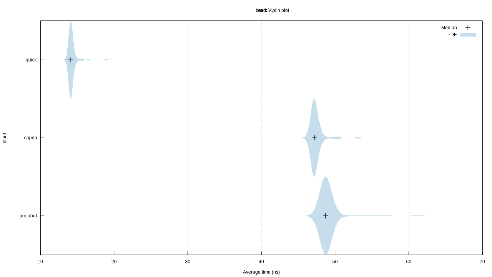
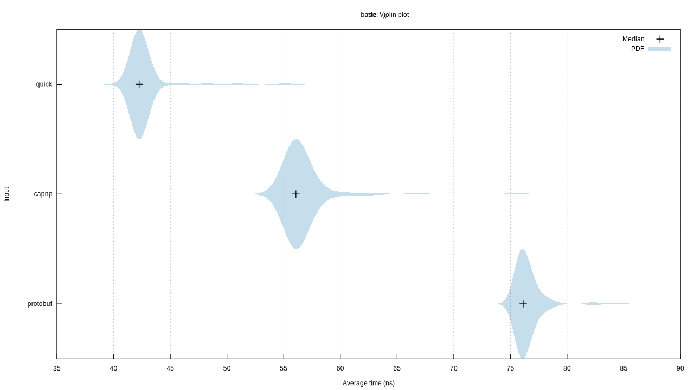
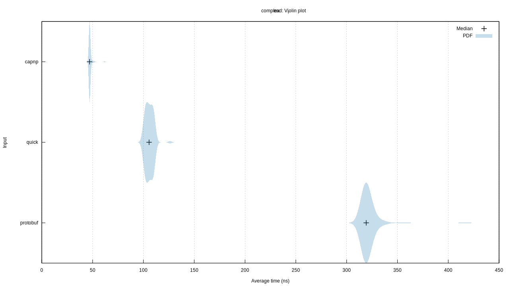
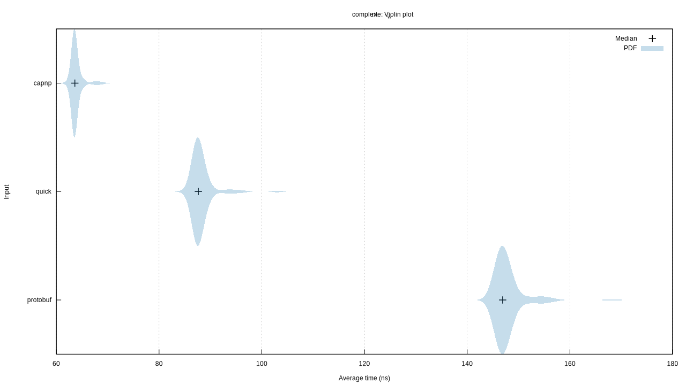

# Protocol Benchmarks

Below some details about the tests, graphs generated by Criterion will be included.

A conclusion drawn from pure (de)serialization times would suggest that one should always use Cap'n Proto.

Running `cargo bench` in this repository can be done to explore these results on your system.

The structs used to test these can be viewed in the [`protos`](protos) directory, summarized here for easy access:

```capnp
@0xd1f1c56543bdb3ac;

struct Basic {
    id @0 :UInt64;
}

struct Complex {
    name @0 :Text;
    basic @1 :Basic;
    reference @2 :Text;
}
```

```protobuf
syntax = "proto2";
option optimize_for = SPEED;

package bench;

message Basic {
    required uint64 id = 1;
}

message Complex {
    required string name = 1;
    required Basic basic = 2;
    required string reference = 3;
}
```

## Basic Read



## Basic Write



## Complex Read



## Complex Write



## Todo

A further set of benchmarks will be added to this that includes the time to construct the structs used in these benchmarks as those can be unexpectedly different.