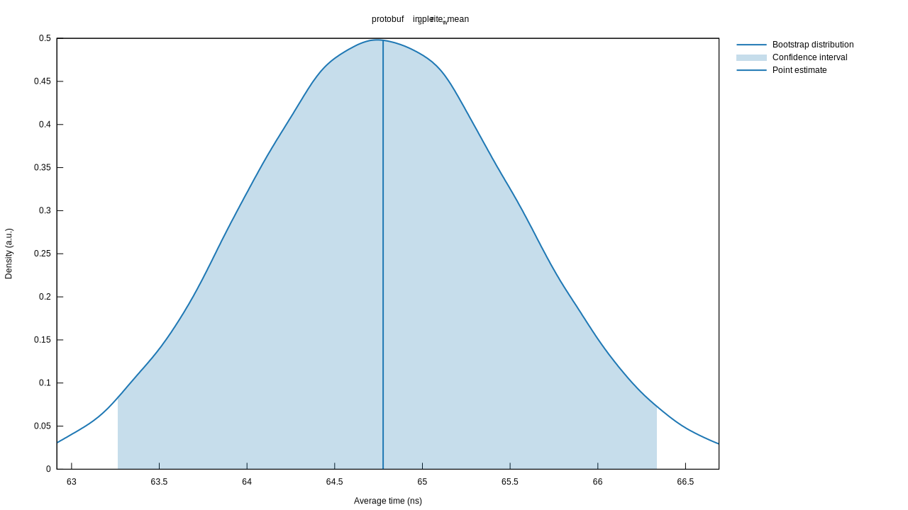
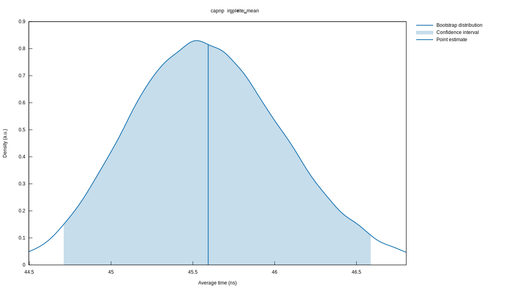
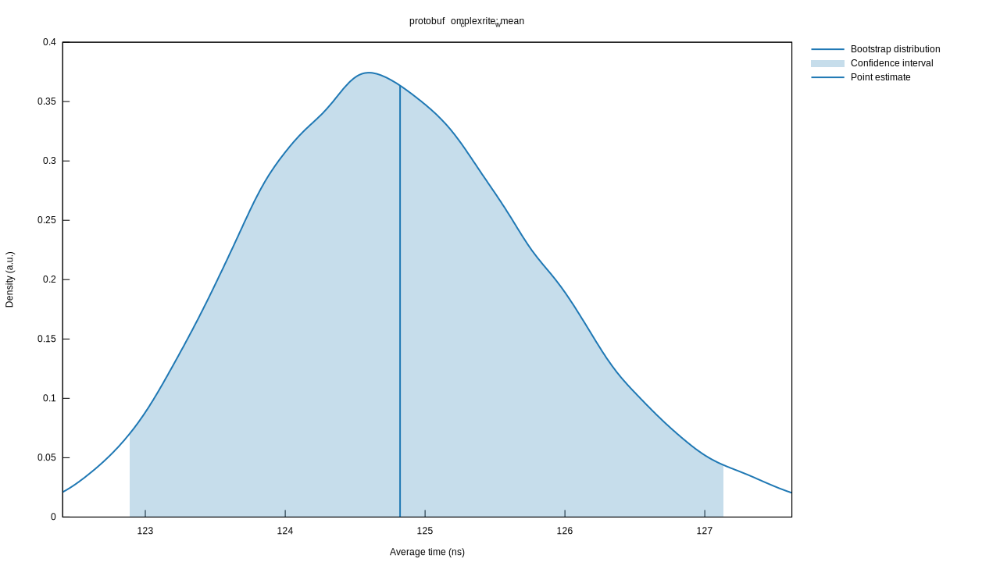
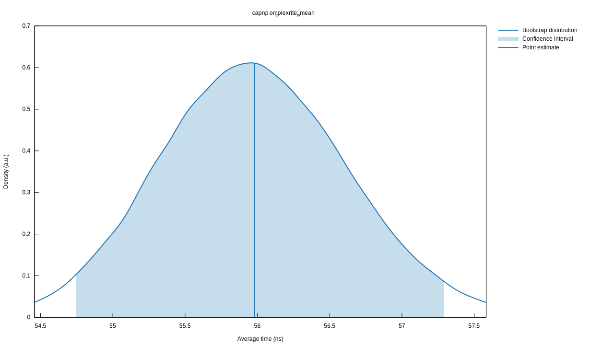
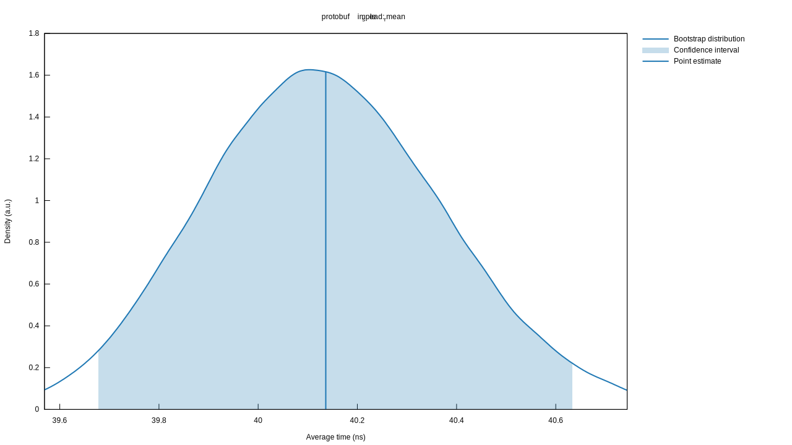
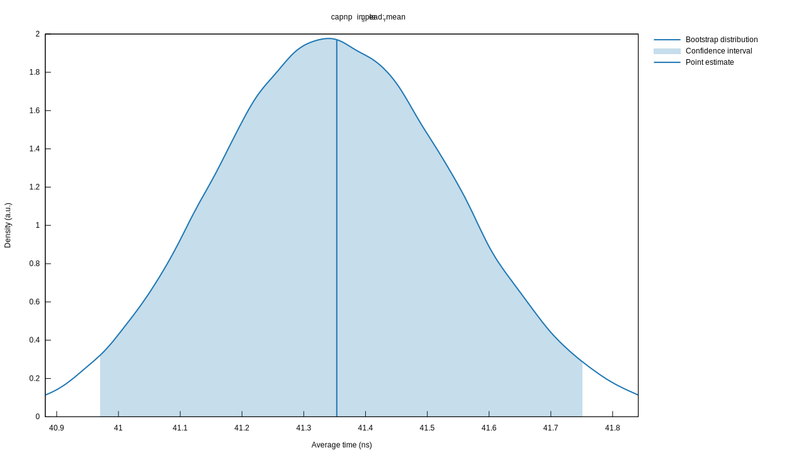
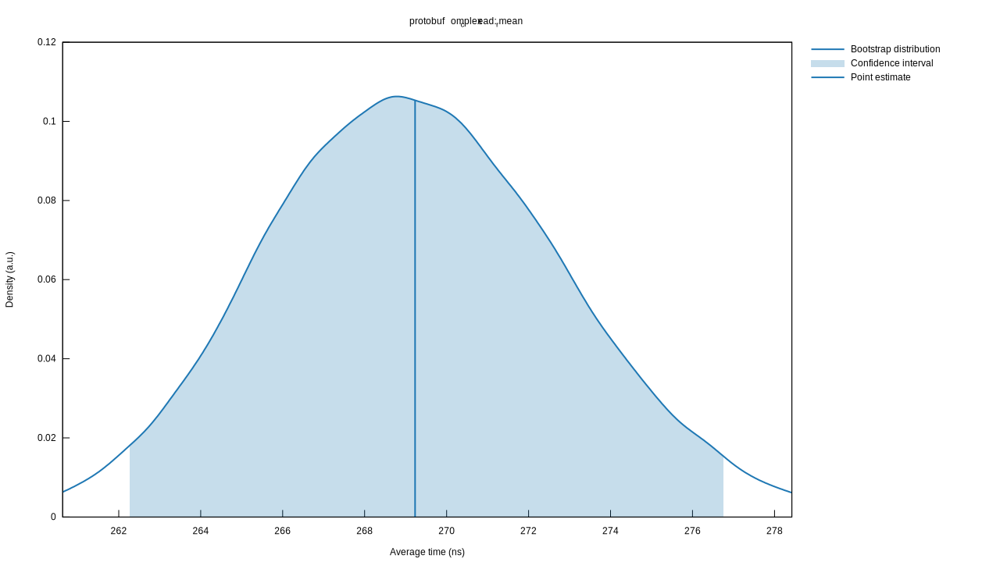
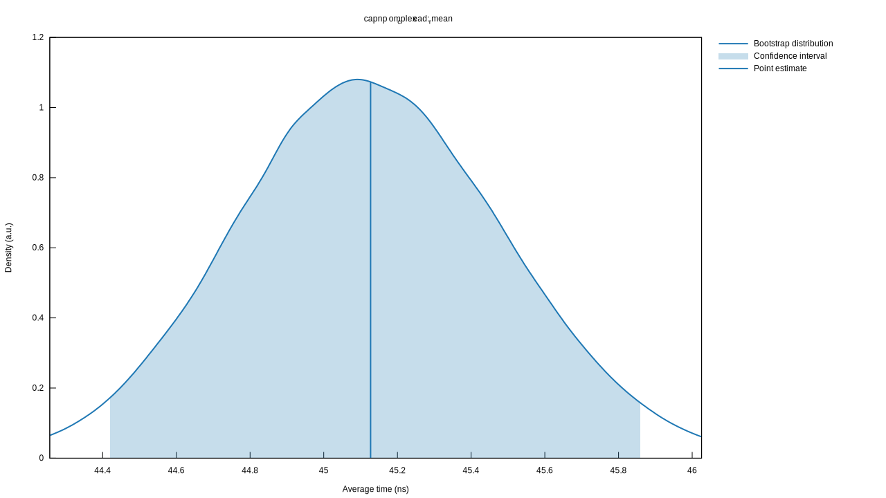

# Protocol Benchmarks

Below some details about the tests, graphs generated by Criterion will be included. 

Running `cargo bench` in this repository can be done to explore these results on your system. On my laptop, I get:

```
capnp_complex_read      time:   [43.449 ns 44.265 ns 45.165 ns]
protobuf_complex_read   time:   [255.47 ns 261.17 ns 266.99 ns]

capnp_complex_write     time:   [58.193 ns 59.606 ns 61.258 ns]
protobuf_complex_write  time:   [123.12 ns 124.77 ns 126.63 ns]

capnp_simple_read       time:   [40.555 ns 40.868 ns 41.211 ns]
protobuf_simple_read    time:   [39.979 ns 40.404 ns 40.886 ns]

capnp_simple_write      time:   [43.809 ns 44.536 ns 45.347 ns]
protobuf_simple_write   time:   [64.494 ns 66.351 ns 68.255 ns] 
```

The structs used to test these can be viewed in the [`protos`](protos) directory, summarized here for easy access:

```capnp
@0xd1f1c56543bdb3ac;

struct Basic {
    id @0 :UInt64;
}

struct Complex {
    name @0 :Text;
    basic @1 :Basic;
    reference @2 :Text;
}
```

```protobuf
syntax = "proto2";
option optimize_for = SPEED;

package bench;

message Basic {
    required uint64 id = 1;
}

message Complex {
    required string name = 1;
    required Basic basic = 2;
    required string reference = 3;
}
```

## Serialization

### Basic

| Protobuf | Cap'n Proto |
|----------|-------------|
|||

## Complex

| Protobuf | Cap'n Proto |
|----------|-------------|
|||

## Deserialization

### Basic

| Protobuf | Cap'n Proto |
|----------|-------------|
|||

## Complex

| Protobuf | Cap'n Proto |
|----------|-------------|
|||